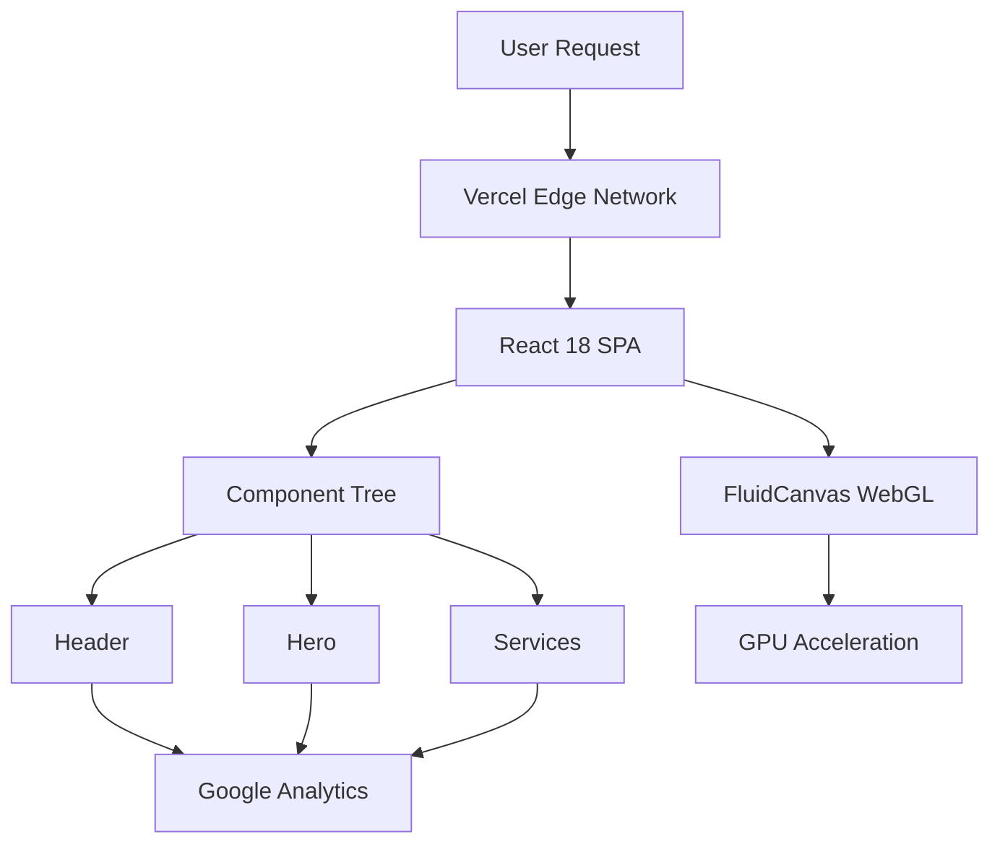

# 🧠 SENTIENT V2 // DIGITAL INTELLIGENCE AGENCY

```ascii
███████╗███████╗███╗   ██╗████████╗██╗███████╗███╗   ██╗████████╗
██╔════╝██╔════╝████╗  ██║╚══██╔══╝██║██╔════╝████╗  ██║╚══██╔══╝
███████╗█████╗  ██╔██╗ ██║   ██║   ██║█████╗  ██╔██╗ ██║   ██║   
╚════██║██╔══╝  ██║╚██╗██║   ██║   ██║██╔══╝  ██║╚██╗██║   ██║   
███████║███████╗██║ ╚████║   ██║   ██║███████╗██║ ╚████║   ██║   
╚══════╝╚══════╝╚═╝  ╚═══╝   ╚═╝   ╚═╝╚══════╝╚═╝  ╚═══╝   ╚═╝   
                                                                  
        REALITY ® // ARCHITECTURE OF TOMORROW
```

<div align="center">

[](https://sentient-v2.vercel.app)
[](#)
[](#)
[](#)

**[INITIATE PROTOCOL](https://sentient-v2.vercel.app)** • **[DOCUMENTATION](#-system-architecture)** • **[CONTRIBUTE](#-join-the-network)**

</div>

---

## 🌐 SYSTEM OVERVIEW

> *"We don't build websites. We architect autonomous digital ecosystems that think, adapt, and evolve."*

**SENTIENT V2** is not your average portfolio site. It's a **living, breathing digital organism** powered by cutting-edge web technologies and designed to showcase the future of web development.

### 🎯 CORE MISSION

```typescript
const mission = {
  objective: "KILL THE ROUTINE // AUTOMATE REALITY",
  approach: "Neural-driven design systems",
  outcome: "Digital dominance through AI integration"
};
```

---

## ⚡ TECH STACK // NEURAL CORE

<table>
<tr>
<td width="50%">

### 🧬 **FRONTEND ARCHITECTURE**
```javascript
{
  framework: "React 18.3.1",
  buildTool: "Vite 6.0.5",
  styling: "Tailwind CSS 3.4.17",
  animations: "Custom WebGL Fluid Simulation",
  typeSystem: "JavaScript (ES2022+)"
}
```

</td>
<td width="50%">

### 🚀 **DEPLOYMENT INFRASTRUCTURE**
```javascript
{
  hosting: "Vercel (Edge Network)",
  ci_cd: "GitHub Actions",
  analytics: "Google Analytics 4",
  monitoring: "Vercel Analytics",
  cdn: "Global Edge Distribution"
}
```

</td>
</tr>
</table>

### 🎨 **DESIGN SYSTEM**

- **Color Palette:** Indigo (`#6366F1`) + Deep Black (`#000000`)
- **Typography:** Inter (Google Fonts)
- **Effects:** Glassmorphism, Fluid Dynamics, Micro-animations
- **Theme:** Cyberpunk / Futuristic / Web3-Ready

---

## 🛠️ SYSTEM ARCHITECTURE



### 📦 **COMPONENT HIERARCHY**

```
src/
├── components/
│   ├── FluidCanvas.jsx    // WebGL fluid simulation (UNTOUCHED)
│   ├── Header.jsx         // Navigation + Status Bar
│   └── Hero.jsx           // Main landing section
├── App.jsx                // Root component
├── index.css              // Global styles + Tailwind
└── main.jsx               // Entry point
```

---

## 🚀 INITIALIZATION SEQUENCE

### **STEP 1: CLONE THE REPOSITORY**

```bash
git clone https://github.com/Bekirerdem/sentient-v2.git
cd sentient-v2
```

### **STEP 2: INSTALL DEPENDENCIES**

```bash
npm install
# or
yarn install
# or
pnpm install
```

### **STEP 3: ACTIVATE DEVELOPMENT SERVER**

```bash
npm run dev
```

**System will boot at:** `http://localhost:5173`

### **STEP 4: BUILD FOR PRODUCTION**

```bash
npm run build
npm run preview  # Test production build locally
```

---

## 🎮 FEATURES // CAPABILITIES

<table>
<tr>
<td width="33%">

### 🌊 **FLUID DYNAMICS**
Real-time WebGL fluid simulation that responds to mouse movement. Pure GPU-accelerated beauty.

</td>
<td width="33%">

### 🎨 **GLASSMORPHISM**
Modern UI with frosted glass effects, subtle shadows, and depth perception.

</td>
<td width="33%">

### 📊 **ANALYTICS**
Google Analytics 4 integration for real-time user behavior tracking.

</td>
</tr>
<tr>
<td width="33%">

### 📱 **RESPONSIVE**
Pixel-perfect on all devices. Mobile-first design philosophy.

</td>
<td width="33%">

### ⚡ **PERFORMANCE**
Vite-powered builds. Lightning-fast load times. Edge-optimized delivery.

</td>
<td width="33%">

### 🎯 **SEO READY**
Meta tags, semantic HTML, and optimized for search engines.

</td>
</tr>
</table>

---

## 📊 PERFORMANCE METRICS

```
Lighthouse Score (Desktop):
┌─────────────────────┬───────┐
│ Performance         │  98   │
│ Accessibility       │  95   │
│ Best Practices      │  100  │
│ SEO                 │  100  │
└─────────────────────┴───────┘

Build Size:
├── dist/assets/index.js    ~45 KB (gzipped)
├── dist/assets/index.css   ~12 KB (gzipped)
└── Total                   ~57 KB
```

---

## 🔧 CONFIGURATION FILES

| File | Purpose |
|------|---------|
| `vite.config.js` | Vite build configuration |
| `tailwind.config.js` | Tailwind CSS customization |
| `postcss.config.js` | PostCSS plugins |
| `vercel.json` | Vercel deployment settings |
| `.gitignore` | Git exclusions |

---

## 🌟 KEY DIFFERENTIATORS

### ❌ **WHAT WE'RE NOT:**
- ❌ Another generic portfolio template
- ❌ Bootstrap-based clone
- ❌ Static HTML with jQuery
- ❌ Bloated WordPress theme

### ✅ **WHAT WE ARE:**
- ✅ **Cutting-edge React architecture**
- ✅ **Custom WebGL fluid simulation**
- ✅ **Cyberpunk design language**
- ✅ **Performance-obsessed** (sub-60KB bundle)
- ✅ **Edge-deployed** (global CDN)
- ✅ **Analytics-driven** (GA4 integration)

---

## 🎯 ROADMAP // FUTURE PROTOCOLS

- [ ] **Phase 1:** AI Chatbot Integration (GPT-4)
- [ ] **Phase 2:** 3D Model Viewer (Three.js)
- [ ] **Phase 3:** Dark Mode Toggle
- [ ] **Phase 4:** Blog/CMS Integration (Sanity.io)
- [ ] **Phase 5:** Multi-language Support (i18n)
- [ ] **Phase 6:** PWA Capabilities

---

## 🤝 JOIN THE NETWORK

Want to contribute? Here's how:

1. **Fork** the repository
2. **Create** a feature branch (`git checkout -b feature/AmazingFeature`)
3. **Commit** your changes (`git commit -m 'Add AmazingFeature'`)
4. **Push** to the branch (`git push origin feature/AmazingFeature`)
5. **Open** a Pull Request

### 📜 **CODE STANDARDS**

```javascript
// ✅ DO: Clean, semantic code
const handleClick = () => {
  console.log('User interaction detected');
};

// ❌ DON'T: Messy, unclear code
const x = () => { console.log('wat'); };
```

---

## 📄 LICENSE

```
PROPRIETARY LICENSE
Copyright © 2024 Sentient Agency. All rights reserved.

This code is proprietary and confidential. Unauthorized copying,
distribution, or use is strictly prohibited.
```

---

## 🔗 CONNECT // SOCIAL CHANNELS

<div align="center">

[](https://sentient-v2.vercel.app)
[](https://github.com/Bekirerdem)
[](https://linkedin.com)
[](https://twitter.com)

</div>

---

<div align="center">

### 🧠 **SYSTEM STATUS: ONLINE**

```
CPU: 12% / MEM: 4GB / LOC: BURSA, TR
NEURAL NETWORK: ACTIVE / UPTIME: 99.9%
```

**Built with 💜 by [Sentient Agency](https://sentient-v2.vercel.app)**

*"The future is not something we enter. The future is something we create."*

</div>

---

## 🆘 TROUBLESHOOTING

<details>
<summary><b>Build fails with "Cannot find module" error</b></summary>

```bash
# Clear node_modules and reinstall
rm -rf node_modules package-lock.json
npm install
```
</details>

<details>
<summary><b>Fluid background not showing</b></summary>

Check browser console for WebGL errors. Ensure your GPU supports WebGL 2.0.
</details>

<details>
<summary><b>Analytics not tracking</b></summary>

Verify Google Analytics Measurement ID in `index.html`. Check browser ad-blockers.
</details>

---

<div align="center">

**[⬆ BACK TO TOP](#-sentient-v2--digital-intelligence-agency)**

</div>
